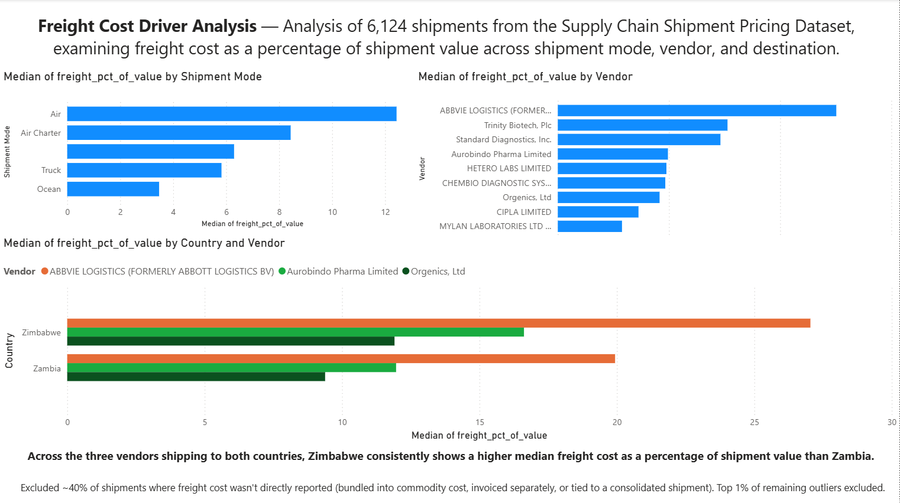

# Freight Cost Driver Analysis

Analysis of 6,124 shipment records from the Supply Chain Shipment 
Pricing Dataset, identifying what drives freight cost as a percentage 
of shipment value across shipment mode, vendor, and destination.

## Key Findings

1. **Shipment mode drives cost significantly** — Air freight (Air and 
   Air Charter) costs 2-3x more relative to shipment value than Truck 
   or Ocean, holding true at both median and 75th percentile.

2. **Vendor cost varies 4x among comparable partners** — Among 
   high-volume vendors, freight cost ranges from 5.8% (Mylan 
   Laboratories) to 25.0% (ABBVIE Logistics) of shipment value.

3. **Destination is an independent cost driver** — Controlling for 
   both vendor and shipment mode, Zimbabwe consistently costs more 
   than Zambia to ship to (12.4% vs. 5.7% median), confirmed via 
   Mann-Whitney U test (p < 0.001). This held across every vendor 
   shipping to both countries, ruling out vendor pricing as the 
   explanation.

## Data Cleaning Challenges

- ~40% of records had non-numeric freight cost values (bundled into 
  commodity cost, invoiced separately, or referencing a consolidated 
  shipment's freight charge elsewhere in the dataset)
- Removed rows with $0 line item value to prevent division errors
- Excluded the top 1% of remaining records as statistical outliers 
  (99th percentile cutoff)

## Methodology

- **Tools:** Python (pandas, scipy, statsmodels), Power BI
- **Approach:** Calculated freight cost as % of shipment value, then 
  tested shipment mode, vendor, and destination as potential drivers, 
  checking each for confounding with the others via crosstabs and a 
  multi-variable OLS regression
  - **Confounding validation:** Tested whether the destination effect was actually 
  driven by vendor or shipment mode by holding each constant — compared one 
  vendor (Aurobindo) across 10 destinations, and compared multiple vendors 
  shipping to both Zambia and Zimbabwe directly. The destination effect held 
  in both tests, ruling out vendor and mode as alternative explanations.
- **Statistical testing:** Used Mann-Whitney U rather than a t-test 
  due to the right-skewed distribution of freight cost ratios

## Files

- [Freight Cost Analysis](freight_cost_analysis.ipynb) — full analysis notebook
- `dashboard_image.png` — final Power BI dashboard
- `README.md` — this file

## Data Source

[Supply Chain Shipment Pricing Data](https://www.kaggle.com/datasets/divyeshardeshana/supply-chain-shipment-pricing-data) — USAID 
health commodity shipment data, via Kaggle
